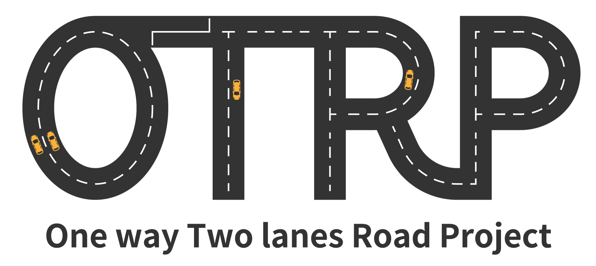
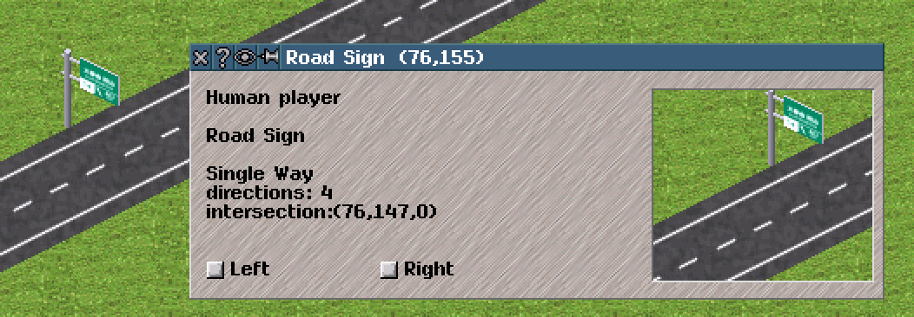
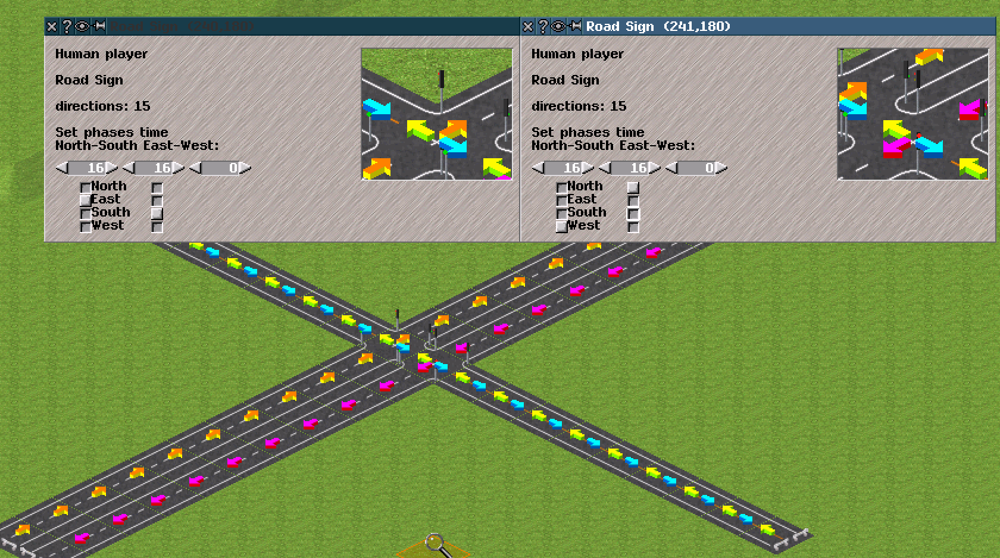

  
This logo was made by [128Na](https://twitter.com/128na) .  

[日本語はこちら](OTRP_v13_information.md)  

# What is OTRP?
This is a modified version of simutrans that some features are added to.  
- Road vehicles take full advantage of two lanes. You can build and enjoy a 4-lane highway.
- For road, "citycars do not enter" and "avoid becoming cityroad" features are available.
- Regional mass build and land raise/lower tools are available. These tools are extremely useful for massive development.

You should try OTRP because...
- Easy to start. Just 4 steps. See the Download and Install section.
- You can convert your save data to the format of simutrans standard whenever you want.
- UI is carefully designed so that you can use OTRP in the exactly same way as simutrans standard. Explorer wonderful OTRP features one by one!

The thread in Simutrans International Forum: https://forum.simutrans.com/index.php?topic=16659.0  
Twitter hash tag :  [#OTRPatch](https://twitter.com/hashtag/OTRPatch?src=hash)  

As of version 17_4, OTRP is based on simutrans standard nightly r8562.

# Download
In addition to the executable binary, the ribi-arrow pak is required. Please download it from https://drive.google.com/open?id=0B_rSte9xAhLDanhta1ZsSVcwdzg and put it in your pakset.  

You can download the OTRP executable binary from the links below. **(2018 September 1st, updated to ver 17_4.)**  
windows: https://drive.google.com/open?id=1ZVw8izY_KGjAWM1iyl4-0i6pAu13dzLE  
mac: https://drive.google.com/open?id=1zZncyw5avBLuiw4MBo3ttqM39D0svuFB  
source code: https://github.com/teamhimeh/simutrans/tree/OTRP-distribute  

Makeobj to compile a priority signal addon is available below.
windows: https://drive.google.com/open?id=1fE5kMvvmcI5fOhg0e3cKMC8dFgzEW9wF

# Install
1. Download ribi-arrow and put it into your pakset.
1. In menuconf.tab in the pakset folder, assign an appropriate key to simple_tool[37]. For example, in menuconf.tab, add `simple_tool[37]=,:` and you can use RibiArrow by using the colon key.
1. Download the OTRP executable file and put it in the directory where simutrans.exe already exists.
1. Execute the file that you downloaded.
Please make sure not to overwrite your sve file of simutrans standard.

# How to use
Even if you do not understand what is described below, you can play OTRP as the simutrans standard. Please explorer the features one by one :)
## Road Configuration
  
Select a road icon **with holding a Ctrl key**, then you can configure the road.

[overtaking mode]
- oneway: Road is oneway and vehicles can overtake others under the relaxed condition.
- halt mode: The behavior is same as oneway, except that the vehicle can load passenger on passing lane.
- twoway: Vehicles behaves as in simutrans standard.
- only loading convoy: Vehicles overtake only a stopping vehicle.
- prohibited: All overtaking is prohibited.
- inverted: Lane is reversed.
----
[others]
- avoid becoming cityroad: When this option is enabled, the road never becomes a cityroad.
- citycars do not enter: Citycars are prohibited to enter this road.

### Road configuration check tool
With holding the colon key, connected directions of roads can be checked with the arrow. This feature is available also through the display settings. If some options are enabled on the road, the color changes as follows:
- avoid becoming citycar enabled -> Green
- citycars do not enter enabled -> Magenda
- Both are enabled -> Orange

## lane affinity signs
As the amount of traffic increases, traffic jam at a junction like the image below can be often seen. This is due to lane crossing. A car inside crosses the outside lane to go to exit.  
  

OTRP provides a sign to instruct cars to stay in an appropriate lane. An oneway sign on an oneway road works as a lane affinity sign. Lane affinity is valid until the next intersection, whose coordinate is displayed in the road sign window.
  

When "Left" is enabled, cars that will go left at the next intersection stay in the left lane. When "Right" is enabled, cars that will go right stay in the right lane.  
Lane change can be failed when the traffic is heavy.

For citycars, lane affinity signs are valid only when the distance between the sign and the next intersection is less than  citycar_max_look_forward.

## Traffic lights
  
If you put two traffic signs like the image above in the conventional simutrans, vehicles on the north-south road cannot turn right because of the traffic lights. The phase offset can realize this, but using it is not appropriate for this case.  
In OTRP, you can specify the direction from which vehicles can enter the tile. For example, the settings in the image above enables vehicles to turn right at the intersection properly.

## Priority Signal
NOTE: This feature is a prelimitary release of the patch that was [proposed on the simutrans international forum](https://forum.simutrans.com/index.php/topic,18400.0.html) . **Depending on decisions of the simutrans development team, names and features can be altered. Also, the compatibility of addon can be lost.**  

A pre-signal checks 2 blocks and indicates red as long as the both blocks are free to enter. A priority signal checks 2 block but indicates green even if the second block is not free. Priority signals can be cascaded. You can control the timing at a train waits for a passing train.  
To use this, special addons are required. To make those, in dat file, add
``` is_prioritysignal = 1```  
just as presignals and longblocksignals. Please compile your addons with the dedicated makeobj.

## etc  
- The income/cost message can be turned off in the display settings or by assigning a key to simple_tool[38].
- To realize smooth traffic in an intersection, vehicles reserve tiles in the intersection. With b key, you can check and cancel the reservation of road.
- Use "make halt public" tool with the shift key, and the halt belongs to the current activated player. With the control key, this operation can be done with no cost.
- If you use the land raise/lower tool with ctrl key, the height of selected area are set to the height of the original coordinate. (Implemented by shingoushori)
- If you use the wayobj construction tool with ctrl key, you can specify the interval of wayobj placement.

# Parameters of OTRP
Most of these are stored in the game.
- **citycar_max_look_forward** : define the distance for which citycars determine their route.
- **citycar_route_weight_crowded**, **citycar_route_weight_vacant**, **citycar_route_weight_speed** : parameters for calculating citycars' route.

# Compatibility
## Compatibility of Add-ons
You can use all add-ons for simutrans standard on OTRP. There is no OTRP-specialized add-ons.
## Compatibility of the save data
- Save data of simutrans standard can be loaded on OTRP.
- **When you load the data of OTRP v12 or v13, please press the button "This is a data of OTRP v12 or v13." before the loading.**  
- When you launch OTRP v14 **for the first time**, please **delete autosave.sve** to prevent a crash.
- No compatibility for ex-OTRP.
- If you press "Readable by standard" button, the game is saved so that it is readable by simutrans standard. In this mode, please be ware that **OTRP specific data is lost.**

# Contact Me
If you have any questions or request, please feel free to ask me through the simutrans international forum or [@himeshi_hob](https://twitter.com/himeshi_hob) in Twitter. Every issue reports and your opinions are greatly appreciated.
