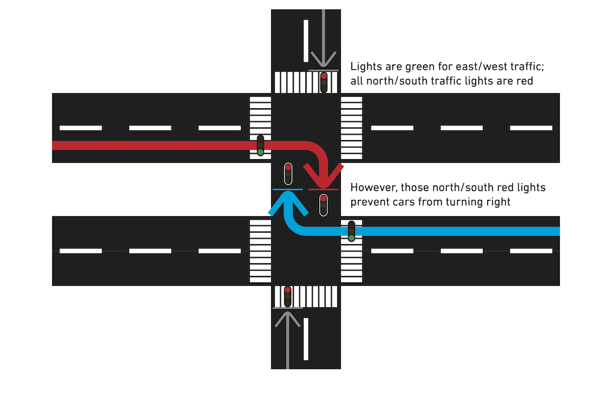
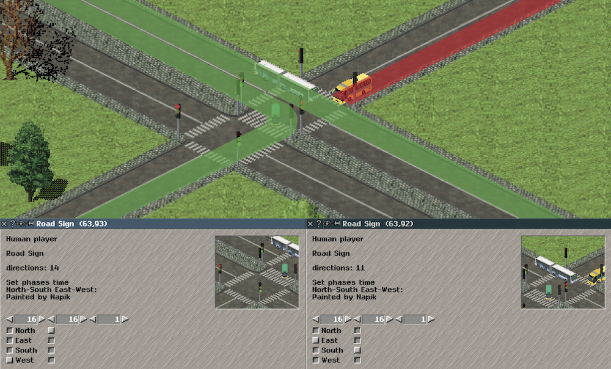
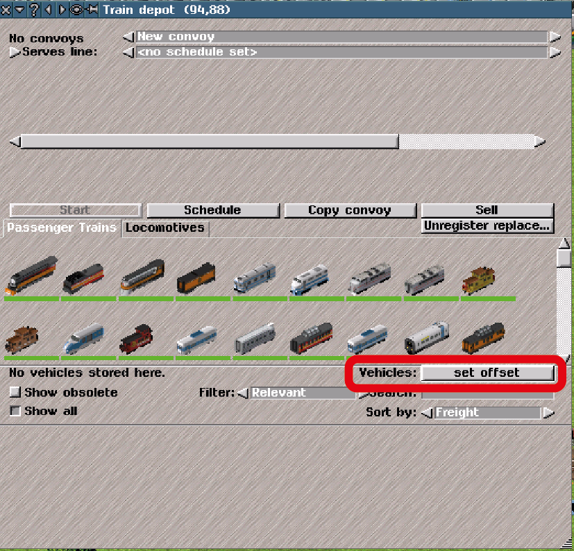
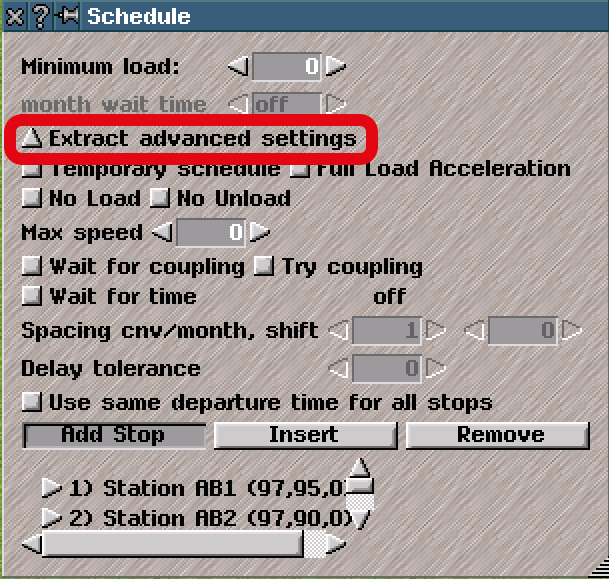

  

This logo was made by [128Na](https://twitter.com/128na).

[日本語はこちら](OTRP_v13_information.md)  

# What is OTRP?
This is a modified version of Simutrans with additional features compared to the standard version.
- You can now build one-way, two-lane roads. Vehicles can overtake each other on these roads. As a result, you can construct 4-lane highways.
- "Citycars do not enter" and "avoid becoming cityroad" options are available for roads.
- When using the building construction and land raise/lower tools, it is possible to click and drag to to apply the tool over a specified area. This greatly simplifies large-scale development.
- Advanced scheduling options allow for precise control of your convoys and lines.

You should try OTRP because...
- Easy to start. Just 4 steps. See the Download and Install section.
- You can convert your save data to the format of Simutrans Standard whenever you want.
- The UI is carefully designed so that you can use OTRP as if you were using Simutrans Standard. Feel free to explore OTRP's wonderful features at your own pace!

The thread in Simutrans International Forum: https://forum.simutrans.com/index.php?topic=16659.0  
Twitter hashtag :  [#OTRPatch](https://twitter.com/hashtag/OTRPatch?src=hash)  

As of version 27, OTRP is based on Simutrans Standard nightly r9186.

# Download
In addition to the executable binary, the ribi-arrow pak is required. Please download it from https://drive.google.com/open?id=0B_rSte9xAhLDanhta1ZsSVcwdzg and put it in your pakset folder.  

You can download the OTRP executable binary from the links below. **(2020 August 29th, updated to ver 27.)**  
windows(GDI 64bit): https://osdn.net/projects/otrp/downloads/73508/sim-WinGDI64-OTRPv27.exe/  
windows(GDI 32bit): https://osdn.net/projects/otrp/downloads/73508/sim-WinGDI-OTRPv27.exe/  
mac: https://osdn.net/projects/otrp/downloads/73508/sim-mac-OTRPv27.zip/  
Linux: https://osdn.net/projects/otrp/downloads/73508/sim-linux-OTRPv27.zip/  
source code: https://github.com/teamhimeh/simutrans/tree/OTRP-distribute  

There is no special makeobj for OTRP. Please use one made for Simutrans Standard.

# Install
1. Download the ribi-arrow pak and put it into your pakset.
1. Open menuconf.tab, located in your pakset folder, and assign an appropriate key to simple_tool[37]. For example, to assign the colon key, add `simple_tool[37]=,:` to the file. Pressing this key in-game will open the road configuration check tool.
1. Download the OTRP executable file and put it in the directory where simutrans.exe already exists.
1. Execute the file that you downloaded. Please make sure not to overwrite any existing Simutrans Standard sve files.

## For mac & linux users
OTRP executable binaries require a library called zstd.  
Mac: Install [homebrew](https://brew.sh/index_ja) and execute command `brew install zstd`  
Linux：Compile [zstd](https://github.com/facebook/zstd) from the source code and `make install`. Version 1.4.4 or later is required.

# How to use
Even if you do not understand what is described below, you can play OTRP if you were playing Simutrans Standard. Please explore the features one by one. :)
## Road configuration
  
Select a road tool **while pressing the Ctrl key** in order to configure the road you wish to build.

[Overtaking mode]
- oneway: Road is one-way and vehicles can freely overtake each other.
- halt mode: The behavior is same as oneway, except that vehicles can load passengers in the passing lane.
- twoway: Vehicles behave as in Simutrans Standard.
- only loading convoy: Vehicles overtake only stopped vehicles, such as those loading passengers.
- prohibited: All overtaking is prohibited.
- inverted: Lane directions are reversed.
----
[Other]
- avoid becoming cityroad: When this option is enabled, the road will never become a cityroad.
- citycars do not enter: Citycars are prohibited from entering this road.

### Road configuration check tool
Press the colon key to view roads' configured modes and direction of travel, illustrated with arrows. This feature is also available through the display settings. If roads are configured with certain options enabled, they will be highlighted with colors as follows:
- avoid becoming citycar enabled -> Green
- citycars do not enter enabled -> Magenta
- both are enabled -> Orange

## Lane assignment signs
As the amount of traffic increases, traffic jams at junctions can be often seen, as in the image below. This is due to vehicles in the fast lane merging across the slow lane to reach the exit, obstructing the flow of traffic.  
  

OTRP provides a sign to assign lanes to vehicles, smoothing the flow of traffic. Placing a one-way sign on a one-lane road enables lane assignments, which are valid until the next intersection, the coordinate of which is displayed in the road sign window.  
  

When "Left" is enabled, cars that will turn or exit left at the next intersection will take the left lane. Cars going straight on will take the right lane. When "Right" is enabled, cars that turn or exit right will take the right lane, and cars going straight on will take the left lane. 
However, lane changes can fail when there is heavy traffic.

For citycars, lane assignment signs are valid only when the distance between the sign and the next intersection is less than citycar_max_look_forward (described further below.)

## Traffic lights
In Simutrans, traffic lights only control traffic on one tile. This works for Simutrans Standard, where all intersections cover only one tile. However, with OTRP, you can build four-lane roads. Therefore, intersections with these roads will cover at least two tiles. 

To control such intersections, you will need to place traffic lights on all tiles of the intersection. But doing so in Simutrans Standard will prevent vehicles from making turns that cross the opposite side of the road; as shown in the image above, the timing of the traffic lights will conflict with each other. Phase offsets can be used as a workaround in Simutrans Standard, but are difficult to manage and not a good permanent solution.

  

In OTRP, you can configure the directions from which vehicles can enter tiles during each phase of a traffic light. By adding specific entrance directions to each phase of all traffic lights in an intersection, you can resolve signal conflicts and allow traffic to turn properly. For example, in the image above, when the southern traffic light allows traffic to flow from the east to the west, it also allows traffic from the north, therefore allowing eastbound traffic to make right turns, while still blocking north-south traffic. Conversely, the northern traffic light allows traffic to enter from the south during the west-east phase, allowing westbound traffic to turn right.

To confirm a traffic light's current status, open its window and check the "directions" display. A number will be assigned to each direction: 1 for north, 2 for east, 4 for south, and 8 for west. The direction display will show the sum of the numbers assigned to all currently valid entrance directions. For example, if traffic is currently allowed to enter the intersection from the north and south, 5 (1+4) will be displayed.

## Change vehicle drawing position
  

Due to an update in graphic specifications, older pak128 rail vehicles will appear to float above the tracks. The "set offset" feature of OTRP fixes this.

In the depot window, click on the operation mode button until "set offset" is displayed. Then click on any vehicles you wish to fix. By default, this will shift all vehicles of the selected type 4 pixels down, correcting the problem.

Offset settings are stored in reposition.tab, located in your pakset's config folder. Open the file with a text editor to adjust the amount of the offset in pixels. Reposition.tab is saved only when you start Simutrans with a 128-pixel pakset, but will be read whenever Simutrans is started, regardless of pakset size.

## Schedule settings
  

OTRP's advanced schedule settings create flexible operational possibilities. Advanced schedule settings can be accessed via opening the corresponding drop-down menu in the Edit Schedule window of a line or convoy.

- **Temporary schedule**: The schedule will not affect passenger routing calculation (described further below). This is useful for setting up lines intended to relieve existing overburdened lines without changing passenger routing behavior.
- **Full load acceleration**: Specifies that all convoys acclerate as if they were at full load, regardless of their actual load. This prevents emptier, lighter convoys from catching up to fuller, heavier convoys, which causes convoys to bunch together.
- **No load**: Select a station on the schedule, then apply this setting to prevent passengers from boarding at this station.
- **No unload**: Select a station on the schedule, then apply this setting to prevent passengers from exiting or transfering at this station.
- **Unload All**: Select a station on the schedule, then apply this setting to make all loads once get off at this station.
- **Max speed**: Specifies the maximum speed convoys can travel on this line. Useful for maintaining consistent spacing between convoys when vehicles with differing maximum speeds are used on a line.

## Convoy coupling

Please refer [here](Convoy_Coupling_Eng.pdf) for information on how to use this feature.

## Specify departure time

Selecting "wait for time" instructs convoys to depart from a station at specified intervals of time, resulting in evenly-spaced convoys along a line.

Instead of Simutrans Standard's in-game time system, this feature uses a different time measurement system, displayed next to the Simutrans Standard time on the bottom-left of the screen. By default, this measurement system divides a month by 1440 units; this can be adjusted by changinging the **spacing_shift_divisor** setting in the "General" tab of the **advanced settings** window. 

  

Specify departure times by adjusting **Spacing cnv/month**, **shift**, and **delay tolerance**.

- **Spacing cnv/month**: This sets how many convoys will depart per month. For example, setting this to 4 with the default month length of 1440 units creates four departure slots per month, allowing convoys to depart every 360 units (1440/4=360).
- **Shift**: This allows you to shift the departure slots of all convoys on a line by a specified amount. By default, zero shift is applied; this means that the first convoy of the month will depart precisely at the start of each month, at 0 units. Adding a shift will push back the departure slots of all convoys by the specified amount; it will not change the spacing between convoys. For example, applying a shift of 10 to a schedule where convoys departed every 100 units would mean that convoys would now depart at 10, 110, and 210 units instead of 0, 100, and 200 units (and so on until the end of the month.)
- **Delay tolerance**: By default, all convoys that miss a departure slot will have to wait for the next scheduled departure slot before leaving. For example, if departure slots were specified at 100 and 200 units, a convoy arriving at the station at 101 units would have to wait 99 units for the next slot before it could depart. The delay tolerance setting creates a window of time after each departure slot, during which convoys can immediately depart even if they have missed their departure slots. This prevents convoys from having to wait for excessive amounts of time for departure slots to open. For example, in a scenario where a departure slot is at 100 units, setting a delay tolerance of 30 means that a convoy could arrive at the station as late as 130 units and still depart without waiting for the next slot.   

Finally, toggling "use same departure time for all stops" applies all departure time settings to all stations listed on the schedule.

## Other 
- The income/cost display that appears whenever a convoy arrives at a stop can be turned off in the display settings or by assigning a key to simple_tool[38].
- To ensure smooth traffic flow in intersections, vehicles reserve tiles in intersections. With the b key, you can check and cancel road reservations.
- Assign any station to the current player by using the "make stop public" tool while pressing the shift key. Using the tool while pressing the shift and control key instead will perform the operation at no cost.
- If you use the "make stop public" tool while pressing the control key, the station is assigned to the public player while the buildings of the station still belong to the original player.
- If you use the land raise/lower tool while pressing the control key, the height of the entire selected area will be set to the height of the original coordinate. (Implemented by shingoushori)
- Area selection is available for the building construction tool. Click and drag to build the selected building(s) across the entire selected area. (Implemented by shingoushori)
- Area selection is available for the remove tool. Again, click and drag to select an area across which all objects will be removed. Press the shift key while using the tool to enable multi-level area selection. Press both the shift and control keys while using the tool to remove all objects on and above the selected area. (Implemented by shingoushori)
- Hold the shift key down to select multiple items in the city building construction window. City buildings are randomly chosen from the selected items and are constructed in the designated area.
- Press the control key while selecting the wayobj construction tool in order to configure the spacing of wayobj placement.
- Press the control key while selecting any elevated way construction tool in order to specify a height offset. This is useful for building elevated ways at very high altitudes.
- The warning about duplicate add-on names is disabled in OTRP. The warning will be shown if Simutrans is launched with the **-showoverlay** option enabled or is launched in network mode.
- In OTRP, long block signals reserve all tiles between it and the next signal, even if by doing so it reserves a path beyond the end of the convoy's route or next stop. This is a preliminary implementation of a feature that was discussed in the international Simutrans forum.
- With the `-snapshot x,y,z,f` option, Simutrans takes a snapshot and immediately quits. x, y, and z are the central coordinates, and f is the zoom factor, which can range from 0 to 9.
- The replacement seed button automates convoy replacement. In a depot, select a convoy that you wish to replace other convoys with and set it as the replacement seed. The vehicles of convoys that subsequently arrive at the depot will be replaced with vehicles of the replacement seed. Press "unregister replacement" while the seed is selected in order to end convoy replacement.
- The journey time between stations is recorded for each line and can be accessed from the Line Management window. Time is recorded in the same units used to specify departure times (see "Specify departure times" above.)

# Parameters of OTRP
Most of these are stored in-game.

## Citycar routing
- **citycar_max_look_forward** : Defines the distance for which citycars determine their route. Decreasing this value means that lane assignment signs placed far from intersections and junctions may not function. Increasing this value may result in differences arising between assumed and actual traffic conditions.
- When a citycar enters an intersection while determining its route, it chooses a route by assigning a weight to each possible direction. **citycar_route_weight_crowded**, **citycar_route_weight_vacant**, **citycar_route_weight_speed** are parameters used to weight each direction (referred to here as cr, va, and sp, respectively.)
	- Citycars will only make U-turns on non-intersection tiles if they have no other options.
	- U-turns at intersections are given a weight of **1**.
	- **cr** sets the weight given when there is a car stopped on the road. The default value is 20.
	- When the road is empty, the weight is calculated by multiplying the **speed limit of the road** by *sp**, the product of which is then added to **va**. The default value of va is 100, and the default value of sp is 0.
	
## Other
- **stop_at_intersection_without_traffic_light**: When this is enabled, road vehicles will stop at all intersections without traffic lights. This is disabled by default.	
- **advance_to_end** : When this is enabled, trains always advance to the ends of platforms. When false, trains stop at the exact coordinates specified in the schedule as long as the platform is long enough to accomodate the entire convoy. This is the same behavior as in Simutrans Standard, and is enabled by default.
- **routecost_halt**, **routecost_wait**: These settings determine passenger routing behavior. A cost is assigned to each stop and transfer made along a journey, with passengers choosing journeys with the lowest cost. routecost_halt is the cost of each stop; the default value is 1. routecost_wait is the cost of each transfer, with a default value of 8.

# Compatibility
## Add-on compatibility
You can use all add-ons for Simutrans Standard in OTRP. There are no OTRP-exclusive add-ons.
## Save data compatiblity
- Simutrans Standard save data can be loaded into OTRP.
- **When you load OTRP v12 or v13 save data, please press the button "This is a data of OTRP v12 or v13." before loading.**  
- When you launch OTRP v14 **for the first time**, please **delete autosave.sve** to prevent crashing.
- There is no compatibility with Simutrans Extended-OTRP (ex-OTRP) save data.
- If you enable the "Readable by standard" option, the game is saved so that it is readable by Simutrans Standard. In this mode, please be aware that **all OTRP-specific data will be lost.**

# Privacy Policy
From v24_4, OTRP collects your usage data. Only anonymous data is collected and the collected data will be used for statistical analysis only. Please note that **OTRP is not intended to be used by EU citizens** since collected data is stored in Japan and is not GDPR compatible.

The following data is collected.
- version
- language setting
- OS 
- your pak name
- network mode or not
- duration of usage

# License
OTRP is derived from from Simutrans Standard, so OTRP follows [Artistic License](https://github.com/aburch/simutrans/blob/master/simutrans/license.txt). Re-distribution of OTRP (including modified version) is permitted under the following conditions.
- Please follow and respect the original license of Simutrans Standard.
- In case that you distribute OTRP to many and unspecified persons, please notify Himeshi where OTRP is distributed. twitter: [@OTRPatch](https://twitter.com/OTRPatch)

# Contact Me
If you have any questions or requests, please feel free to ask me through the international Simutrans forum (THLeaderH) or [@OTRPatch](https://twitter.com/OTRPatch) in Twitter. All opinions and issue reports are greatly appreciated.
