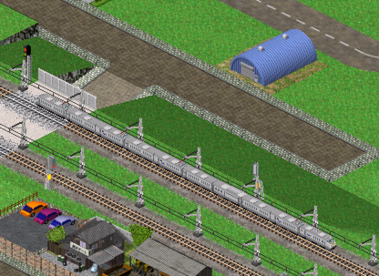
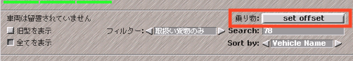
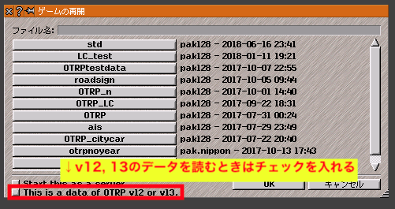

  
（ロゴ提供： [128な人](https://twitter.com/128na) ）  

[Document in English is here.](OTRP_information_en.md)  

# OTRPとは？
本家simutrans standardに機能をいくらか付け加えた改造版Simutransです。  
- 道路で片側二車線走行。往復4車線高速道路が作れるようになります。
- 道路に市道化防止・自家用車進入禁止を設定
- 範囲整地・建築ツールなど大規模開発に適したツール群

といった機能が使えるようになります。
- 導入は簡単です。コンパイルなどは必要ありません。
- セーブデータはいつでもsimutrans standardの形式に戻せます。
- simutrans standardと全く同じように使えます。OTRPの機能を一つ一つ探検してみてください。

本家フォーラム: https://forum.simutrans.com/index.php?topic=16659.0  
Twitterハッシュタグ： [#OTRPatch](https://twitter.com/hashtag/OTRPatch?src=hash)

version22_2現在、simutrans standard nightly r8797をベースにしています。

# ダウンロード
実行には本体の他にribi-arrowアドオンが必要なので https://drive.google.com/open?id=0B_rSte9xAhLDanhta1ZsSVcwdzg からDLしてpakセットの中に突っ込んでください。  

本体は下のリンクからどうぞ。**（2019年8月3日PM10時　ver22_2に更新）**  
windows（GDI）: https://osdn.net/projects/otrp/downloads/71387/sim-WinGDI-OTRPv22_2.exe/  
mac: https://osdn.net/projects/otrp/downloads/71387/sim-mac-OTRPv22_2.zip/    
Linux: https://osdn.net/projects/otrp/downloads/71387/sim-linux-OTRPv22_2.zip/  
ソース: https://github.com/teamhimeh/simutrans/tree/OTRP-distribute  

OTRP専用のmakeobjはありません。simutrans standardのmakeobjをご利用ください。

# 導入方法
1. ribi-arrowをDLしてお使いのpakセットに入れる
2. pakフォルダの中にあるmenuconfでsimpletoolsの37番に適当なキーを割り当てる。例えばmenuconf.tabに`simple_tool[37]=,:`と追記すればコロンを押すとRibiArrowが出現する。
3. 本体をDLし、simutrans.exeが入ってる所と同じディレクトリに実行ファイルを入れる。
4. DLした実行ファイルを起動する。
standard版のsveファイルを上書きしないように気をつけましょう。

## ja.tabについて
https://github.com/teamhimeh/simutrans/blob/OTRP-distribute/documentation/ja.OTRP.tab にOTRP用ja.tabを置いておきました。ご自由にお使いください。

# 使い方
OTRPは使い方を知らなくてもstandardと同じように遊べるようになっています。少しずつ理解していきましょう。
## 道路の設定
  
道路アイコンを**Ctrlキーを押しながら**選択すると追い越しモード等を設定できます。
  
[追越モード]
- oneway: 道路を一方通行にして二車線同じ方向で通行するモードです。このモードの時は道路が一方通行になるので建設時は「:（コロン）」を押して接続方向を確認してください。
- halt mode: 停留所において追越車線でも客扱い・荷捌きをします。走行中の挙動はonewayと同じです。
- twoway: 本家standardの道路と同じ挙動をするモードです。対向車が来ないことが保証されるときのみ追い越しできます。
- only loading convoy: 停車中の車のみ追い越します。
- prohibited: 一切の追い越しが禁止されます。
- inverted: twowayモードの状態から車線が左右反転します。
-----
[その他]
- avoid becoming cityroad: 有効化すると道路は市道化しなくなります。（地面の道路にのみ有効）
- citycars do not enter: 自家用車の進入を禁止します。

### 道路確認ツール
「:（コロン）」キーを押すと、道路の接続方向が矢印で確認できます。（表示設定ウィンドウにあるボタンからも使用できます。）また、市道化防止や自家用車進入禁止が設定されている場合以下に従って色が変化します。
- 市道化防止が有効 → 緑
- 自家用車進入禁止が有効 → ピンク
- 市道化防止・自家用車進入禁止がともに有効 → オレンジ

## 車線誘導標識
交通量が増えてくるとこのように分岐部分で渋滞が発生することがあります。
  
これは内側車線の車が車線をまたいで出口に進もうとして外側車線を塞いでしまうためです。一般道の複数車線信号つき交差点ではこの傾向がより顕著になります。  
OTRPでは標識を使うことで車がどちらの車線を使うか誘導することができます。oneway属性の道路上に一方通行標識を設置すると車線誘導標識になります。車線誘導は「intersection」で示されている座標（標識が設置されたところから次の交差点）まで有効です。  
  
「Left」を有効にすると次の交差点で左に進む車のみ左車線に誘導します。「Right」は右に進む車のみ右車線に誘導します。次の交差点がT字路のばあい、例えば左方向のみに分岐しているT字路であれば直進は右に進むという扱いになります。（なのでRightを有効にすると直進車が右車線に誘導されます。）  
車はこの標識を通過すると指示された車線に移ろうと**努力はします**が交通量が多すぎると車線移動に失敗することがあります。  
なおcitycarでは標識と交差点の距離がcitycar_max_look_forward未満の場合のみ有効です。（設定項目の章を参照）

## 道路信号
  
v13から道路信号の進入許可方向を設定できるようになりました。従来の信号を図のような4車線×2車線の交差点に二つ置くと交差点で車が右折できなくなるので、上図のように進入許可方向を設定してあげるといい感じに右折できるようになります。（例えば図の下側の信号は8ticksの間北・東・南方向への進入を許可し、16ticksの間東・南・西方向への進入を許可するという意味になります。）  
実際の接続方向は「接続方向」の数字で確認できます。この数字は北=1、東=2、南=4、西=8を足し合わせたもので、例えば北と東方向に開通していれば1+2=3と表示されます。  
デフォルトでは進入許可方向は南北-東西で設定されていますが、変更すると「南北：東西：オフセット」の文字列は意味を成していないので気になる方はja.tabの「Set phases」を書き換えてください。

## 車両描画位置の変更
pak128では鉄道車両の描画位置変更が行われた影響で、古い車両アドオンが新描画位置軌道から浮く現象が発生しています。  

  
713氏作　[Emu]JRK Limited Express Electric Cars "Intercity Kyushu" Set/ＪＲ九州　特急列車「インターシティ九州」セット　より

車庫画面で下図赤枠のボタンを押し、「set offset」と表示されるようにしてから車両を選択すると、その車種は4px下に描画されるようになります。これで、新描画位置軌道上に走らせても車両の位置が正しくなります。  
  

オフセットの設定は、pakxyz/config/reposition.tabに保存されます。reposition.tabはテキストファイルなので手で編集することもできます。  
なお、車庫画面でset offsetが出てくるのと、reposition.tabが保存されるのは128系のpakサイズでsimutransを起動したときのみです。reposition.tabの読み込みはその他のサイズのpakで起動したときも行われます。

## 増解結
本機能はInternational Forumで議論中の機能の先行実装です． [本家フォーラムのスレッドはこちら](https://forum.simutrans.com/index.php/topic,19064.0.html)

増解結の使い方は [こちらを参照](how_to_convoy_coupling.pdf) してください．

## その他
- 運賃収受に伴う金額表示をON/OFFできるようになりました。表示設定ウィンドウから切り替えられるほか、simple_tool[38]にキーを割り当てることでも切り替えることができます。
- 交差点でのスムーズな通行を実現するため、交差点タイルでは車両がタイルを予約しています。予約状況は鉄道の閉塞予約解除ツール（bキー）を使うことで確認できます。タイルをクリックすることで予約を手動で解除することもできます。
- 駅/停留所の公共化ツールをshiftを押しながら使うと、現在有効なプレイヤー所属の停留所になります。なおctrlキーを押しながらだと費用ナシで民営化できます。
- 建築物建設ツールで範囲選択ができるようになりました。選択された範囲に現在有効な建築物を配置します。（[shingoushori][1]氏による実装）なお、市内建築物に限り複数種類を選択することが可能です。
- 撤去ツールでも範囲選択が可能です．shiftキーを押すと選択された範囲の全オブジェクトを削除（立体的な選択も可能），shift+ctrlキーで選択された範囲から上の高度に対しても全オブジェクトを削除します．（[shingoushori][1]氏による実装）
- ctrlキーを押しながら土地上げ下げツールを使うと、選択された範囲が始点と同じ高度になります。（[shingoushori][1]氏による実装）
- ctrlキーを押しながらwayobj（架線）建設ツールを使うと、wayobjの設置間隔を設定できます。景観架線で架線柱を2マスごとに置く時などに便利です。
- ctrlキーを押しながら高架建設ツールを使うと、高架の高度オフセットを指定できます。1高度だけ地面から浮いた高架や、高高度の高架を建設するときに便利です。
- 起動時に出現するアドオン名重複警告はOTRPでは無効化されています。ただし、**-showoverlay** オプションをつけて起動したとき及びサーバーモードで起動したときはアドオン名重複警告が表示されます。
- longblocksignal（多閉塞信号）は検査した範囲をすべて予約するようになっています。すなはち、停車駅をこえて次の信号まで予約するようになっています。これは本家フォーラムで議論中の機能の先行実装です。
- 起動時に`-snapshot x,y,z,f`オプションで起動すると、スナップショットを撮影して終了します。x,y,zは中心座標、fはズーム率（0から9まで）です。異なるセーブファイルである固定地点のスクリーンショットを撮りたいときなどに便利です。

# 設定項目
主にsimuconf.tabや「高度な設定」で編集する項目です。  
ほとんどのパラメータはゲーム内に保存されます。
## citycarについて
（この章で説明するパラメータは全て高度な設定の「経路」タブにあります。）
- citycarは交差点ごとにランダムに進行方向を決めて進みます。**citycar_max_look_forward** はcitycarが何マス先まで予め経路を決めておくかを定義します。citycarが車線固定標識に従うには経路情報が必要なため、車線固定標識と対象交差点の距離がこのパラメータ以上だとcitycarは車線固定ができません。但しこの値を大きくすると交差点におけるルート選択のタイミングが早まるため交通状況がルート選択に反映されるタイミングが遅くなります。
- citycarはルート決定をする時交差点に遭遇すると、各方向に対して重み付けをして確率的に方向を決定します。この際、**citycar_route_weight_crowded**, **citycar_route_weight_vacant**, **citycar_route_weight_speed** のパラメータ（以下それぞれcr, va, spと表記）を使用します。
    - 単一タイル上でUターンをするのは他に選択肢がない時のみです。
    - Uターンをする（鋭角に曲がる）方向 → 重みは**1**になります。
    - 道路上に停車している車があるとき、重みは**cr**になります。デフォルト値はcr=20です。
    - 道路が空いているときの重みは**va + speed × sp** となります。speedは道路の制限速度です。デフォルト値はva=100, sp=0です。  
    例) cr=20, va=100, sp=1, 道路の制限速度が60km/hのとき、その道路上に車が存在していなければ選択の重みはva + speed × sp = 100 + 60 × 1 = 160 となります。
- citycarは渋滞などにより交差点手前で停車している時、一定間隔（1倍速で約2秒おき）でルートの再検索を行います。適切に設定されたパラメータのもとでは、これによりデッドロックを予防することができます。

## その他
- **stop_at_intersection_without_traffic_light**（経済タブにあります）のチェックを入れることで、車両が信号機ナシ交差点の手前で特定の条件に従って一時停止するようになります。デフォルトでは無効です。
- **advance_to_end**（ルートタブにあります）のチェックを外すことで列車のホームでの停車位置が実際に指定した位置になります。（デフォルトではstandardと同じく指定位置にかかわらず列車は先頭まで進みます。）なお指定した位置で編成がおさまらないときは編成全体がおさまるまで前進します。（extendedと同じです。）

# データの互換性
## アドオンの互換性
OTRPはsimutrans standard向けのアドオンであれば全て使えます。OTRP専用アドオンというのは存在しません。
## セーブデータの互換性
- simutrans standardのデータは120.3を含めそのまま読み込めます。
- **OTRP v12,13系列のセーブデータを読み込むときは「This is a data of OTRP v12 or v13.」ボタンを押して読み込んでください。**（下図参照）  
  
v12,13を使っていた方で初めてv14を使うときは**autosave.sveを削除**してください。（古いバージョンのautosaveが残っていると起動時にそれを読んでクラッシュします。）
- extended版OTRPとの互換性はありません。
- 一度セーブデータを読み込んでそれを**保存した瞬間に**そのデータは**OTRP専用**になります。既存のデータをOTRPに移行する場合はバックアップを取った上で別ファイルとして保存することを強く推奨します。
- データセーブ時に「Readable by standard」ボタンを押して保存するとstandardで読み書きできる形式で保存されます。この形式では**OTRP固有の情報が失われる**ので注意してください。

# ライセンス
OTRPはSimutrans Standardからの派生物ですので、Standardのライセンスである[Artistic License](https://github.com/aburch/simutrans/blob/master/simutrans/license.txt) に従います。OTRPの再配布および改造したものの配布などについては以下の条件下で自由です。
- Artistic Licenseに違反しない条件下で配布してください。
- 配布する場所をひめしにご連絡ください。 twitter: [@himeshi_hob](https://twitter.com/himeshi_hob)

# おねがい
バグ探しには皆さんのお力が必要です。バグと思われる挙動があればtwitter [@himeshi_hob](https://twitter.com/himeshi_hob) に報告していただけるとありがたいです。  
特に「ネットワークプレイ」が安定動作するかが確認取れてないので遊んでみて動作状況を教えていただけるとうれしいです。ぜひOTRPでNSを楽しんでみてください。

[1]:https://twitter.com/shingoushori
[2]:https://twitter.com/hypersimu
