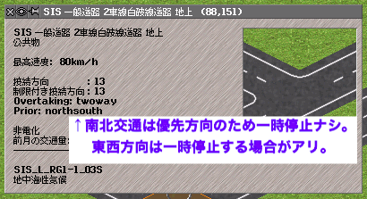

※standard版OTRPのドキュメントです。extendedにOTRPは既に統合されました。
# OTRPとは？
本家simutrans standardに機能をいくらか付け加えた改造版Simutransです。  
OTRPはOneway Twoway Road Patchの略で、日本語通称は「二車線パッチ」です。  
本家Simutransでは片側二車線の高速・幹線道路を引いても実質一車線分しか使ってくれないのでフルで2車線使ってくれるようにするのが本プロジェクトの目的です。

本家フォーラム: https://forum.simutrans.com/index.php?topic=16659.0  

version15現在、simutrans standard nightly r8546をベースにしています。

# ダウンロード
ribi-arrow・信号接続方向制御つきのバイナリのみの提供です。実行には本体の他にribi-arrowアドオンが必要なので https://drive.google.com/open?id=0B_rSte9xAhLDanhta1ZsSVcwdzg からDLしてpakセットの中に突っ込んでください。
本体は下のリンクからどうぞ。**（2018年7月18日AM0時　ver15_1に更新）**  
windows: https://drive.google.com/open?id=19n9Pr-gdQ-NHwW8kAudP-QOZBUvoh3c2  
mac: https://drive.google.com/open?id=1VFpDx82BBc6LZ16EL8KLH7j2u3mPG-9u    
ソース: https://github.com/teamhimeh/simutrans/tree/OTRP-distribute  
※makeobjはstandardのやつをそのまま使ってください

# 導入方法
1. ribi-arrowをDLしてお使いのpakセットに入れる
2. pakフォルダの中にあるmenuconfでsimpletoolsの37番に適当なキーを割り当てる。例えばmenuconf.tabに`simple_tool[37]=,:`と追記すればコロンを押すとRibiArrowが出現する。
3. 本体をDLし、simutrans.exeが入ってる所と同じディレクトリに実行ファイルを入れる。
4. DLした実行ファイルを起動する。
standard版のsveファイルを上書きしないように気をつけましょう。

## ja.tabについて
https://github.com/teamhimeh/simutrans/blob/OTRP-distribute/documentation/ja.OTRP.tab にOTRP用ja.tabを置いておきました。ご自由にお使いください。

# 使い方
## 追い越し属性の設定
  
道路アイコンを**Ctrlキーを押しながら**選択すると「追い越しモード」を選択できます。  
（v13_2からhalt modeが追加されました。）
- oneway: 道路を一方通行にして二車線同じ方向で通行するモードです。このモードの時は道路が一方通行になるので建設時は「:（コロン）」を押して接続方向を確認してください。
- halt mode: 停留所において追越車線でも客扱い・荷捌きをします。走行中の挙動はonewayと同じです。
- twoway: 本家standardの道路と同じ挙動をするモードです。対向車が来ないことが保証されるときのみ追い越しできます。
- only loading convoy: 停車中の車のみ追い越します。
- prohibited: 一切の追い越しが禁止されます。
- inverted: twowayモードの状態から車線が左右反転します。

地面に敷設する道路にのみ「avoid becoming cityroad」オプションが表示されます。このオプションを有効化すると道路は市道化しなくなります。  

道路の接続方向は「:（コロン）」キーを押すことで確認できます。（表示設定ウィンドウにあるボタンからも使用できます。）市道化防止オプションが有効化された道路は緑色になります。

## 車線誘導標識
交通量が増えてくるとこのように分岐部分で渋滞が発生することがあります。
  
これは内側車線の車が車線をまたいで出口に進もうとして外側車線を塞いでしまうためです。一般道の複数車線信号つき交差点ではこの傾向がより顕著になります。  
OTRPでは標識を使うことで車がどちらの車線を使うか誘導することができます。oneway属性の道路上に一方通行標識を設置すると車線誘導標識になります。車線誘導は「intersection」で示されている座標（標識が設置されたところから次の交差点）まで有効です。  
  
「Left」を有効にすると次の交差点で左に進む車のみ左車線に誘導します。「Right」は右に進む車のみ右車線に誘導します。次の交差点がT字路のばあい、例えば左方向のみに分岐しているT字路であれば直進は右に進むという扱いになります。（なのでRightを有効にすると直進車が右車線に誘導されます。）  
車はこの標識を通過すると指示された車線に移ろうと**努力はします**が交通量が多すぎると車線移動に失敗することがあります。

## 道路信号
  
v13から道路信号の進入許可方向を設定できるようになりました。従来の信号を図のような4車線×2車線の交差点に二つ置くと交差点で車が右折できなくなるので、上図のように進入許可方向を設定してあげるといい感じに右折できるようになります。（例えば図の下側の信号は8ticksの間北・東・南方向への進入を許可し、16ticksの間東・南・西方向への進入を許可するという意味になります。）  
実際の接続方向は「接続方向」の数字で確認できます。この数字は北=1、東=2、南=4、西=8を足し合わせたもので、例えば北と東方向に開通していれば1+2=3と表示されます。  
デフォルトでは進入許可方向は南北-東西で設定されていますが、変更すると「南北：東西：オフセット」の文字列は意味を成していないので気になる方はja.tabの「Set phases」を書き換えてください。

## 交差点での車のふるまい
（v14から。**デフォルトでは無効化** されています。）  
信号が設置されていない交差点に車が進入するとき、減速（一時停止）してから交差点に進入します。ただし以下の条件を満たすときは減速せずに交差点に進入します。
- 自分が優先方向（南北or東西）にいるとき
- 左折する時（右側通行の場合は右折する時）
- 一方通行道路で合流する時

優先方向は交差点タイルでの道路の情報にある「**Prior**」です。交通量の多い方向が自動的に優先方向になります。  
  
この機能は「高度な設定」から「stop_at_intersection_without_traffic_light」（経済タブにあります）のチェックを入れることで有効化できます。

## その他
- 運賃収受に伴う金額表示をON/OFFできるようになりました。表示設定ウィンドウから切り替えられるほか、simple_tool[38]にキーを割り当てることでも切り替えることができます。
- 交差点でのスムーズな通行を実現するため、交差点タイルでは車両がタイルを予約しています。予約状況は鉄道の閉塞予約解除ツール（bキー）を使うことで確認できます。タイルをクリックすることで予約を手動で解除することもできます。
- 駅/停留所の公共化ツールをshiftを押しながら使うと、現在有効なプレイヤー所属の停留所になります。なおctrlキーを押しながらだと費用ナシで民営化できます。

# データの互換性
## アドオンの互換性
OTRPはsimutrans standard向けのアドオンであれば全て使えます。OTRP専用アドオンというのは存在しません。
## セーブデータの互換性
- simutrans standardのデータは120.3を含めそのまま読み込めます。
- **OTRP v12,13系列のセーブデータを読み込むときは「This is a data of OTRP v12 or v13.」ボタンを押して読み込んでください。**（下図参照）  
  
v12,13を使っていた方で初めてv14を使うときは**autosave.sveを削除**してください。（古いバージョンのautosaveが残っていると起動時にそれを読んでクラッシュします。）
- extended版OTRPとの互換性はありません。
- 一度セーブデータを読み込んでそれを**保存した瞬間に**そのデータは**OTRPv14以降専用**になります。既存のデータをOTRPに移行する場合はバックアップを取った上で別ファイルとして保存することを強く推奨します。
- データセーブ時に「Readable by standard」ボタンを押して保存するとstandardで読み書きできる形式で保存されます。この形式では**OTRP固有の情報が失われる**ので注意してください。

# おねがい
バグ探しには皆さんのお力が必要です。バグと思われる挙動があればtwitter @himeshi_hob に報告していただけるとありがたいです。  
特に「ネットワークプレイ」が安定動作するかが確認取れてないので遊んでみて動作状況を教えていただけるとうれしいです。ぜひOTRPでNSを楽しんでみてください。
